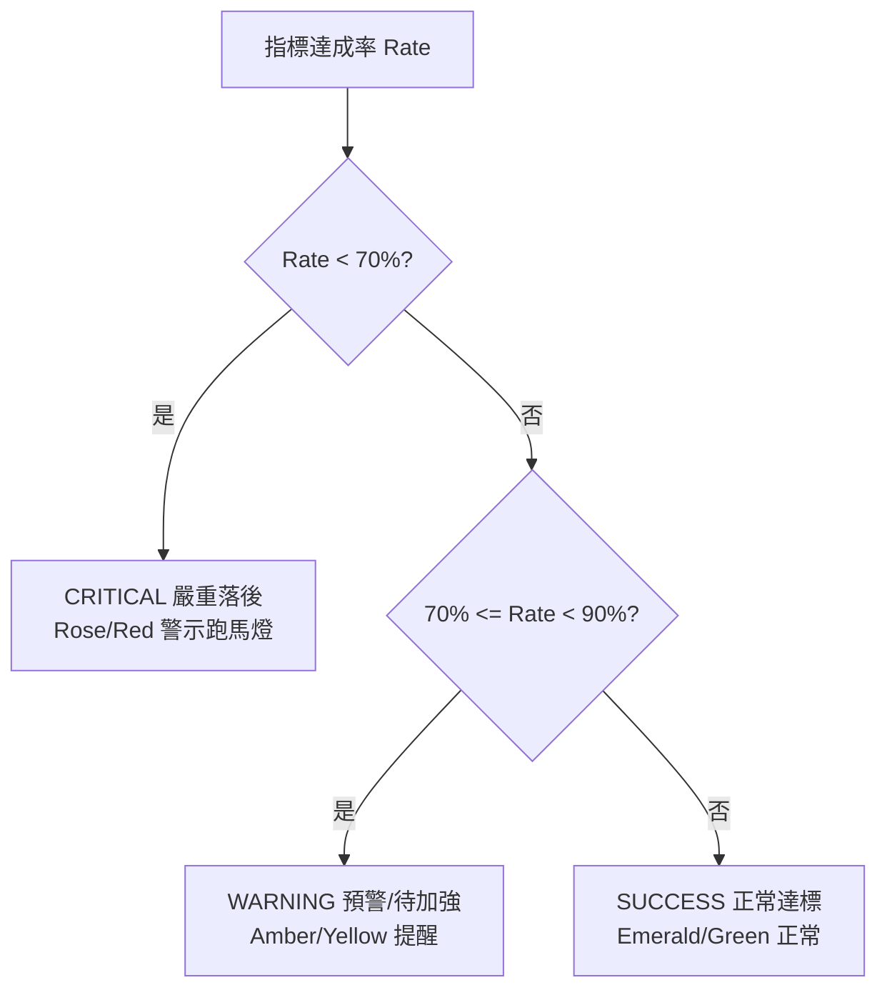

# 輔英科技大學 第二期高教深耕計畫指標 專案製作規範說明檔

> **Specification & Technical Guidelines for Sprout Project Dashboard**  
> 本文件為「輔英科技大學 第二期高教深耕計畫指標 戰情與監控儀表板」之標準製作規範說明檔，包含資料架構 (Data Schema)、燈號邏輯、UI 設計系統、組件架構、匯出規範與 CI/CD 維護流程。

---

## 目錄 (Table of Contents)

1. [資料架構規範 (Data Schema Specification)](#1-資料架構規範-data-schema-specification)
2. [商業邏輯與燈號規則規範 (Business Logic Specification)](#2-商業邏輯與燈號規則規範-business-logic-specification)
3. [UI/UX 設計系統與視覺規範 (UI Design System Specification)](#3-uiux-設計系統與視覺規範-ui-design-system-specification)
4. [前端組件架構規範 (Component Architecture Specification)](#4-前端組件架構規範-component-architecture-specification)
5. [資料匯出與安全性規範 (Data Export Specification)](#5-資料匯出與安全性規範-data-export-specification)
6. [部署與維護規範 (Deployment & Maintenance Specification)](#6-部署與維護規範-deployment--maintenance-specification)

---

## 1. 資料架構規範 (Data Schema Specification)

專案指標主數據庫位於 [src/indicators_data.json](file:///e:/%E6%96%87%E4%BA%AE/%E8%BC%94%E8%8B%B1%27/%E9%AB%98%E6%95%99%E6%B7%B1%E8%80%95%E6%8C%87%E6%A8%99/src/indicators_data.json)，採 JSON Array 結構。所有數據項目必須符合以下 Schema 欄位定義：

### 1.1 JSON 欄位型態規範 (JSON Field Schema)

| 欄位名稱 (Key) | 資料型態 (Type) | 必填 | 範例內容 | 說明與規範 |
| :--- | :--- | :---: | :--- | :--- |
| `id` | `string` | 是 | `"COM_001"` | 指標唯一識別碼（格式：`COM_xxx` 共同指標 / `CUS_xxx` 自訂指標） |
| `type` | `string` | 是 | `"共同指標"` | 指標類別，枚舉值：`"共同指標"` 或 `"自訂指標"` |
| `aspect` | `string` | 是 | `"教學創新精進"` | 所屬深耕四大面向（枚舉值：`教學創新精進` / `善盡社會責任` / `產學合作連結` / `提升高教公共性`） |
| `major_item` | `string` | 是 | `"學生專業實務技術能力推動成效"` | 主項 / 策略項目名稱 |
| `measure` | `string` | 是 | `"學生通過證照數人次"` | 具體觀測指標名稱 |
| `unit` | `string` | 是 | `"人次"` | 計量單位（如：人次、項、%、場、件） |
| `target_val` | `string` | 是 | `"1000 人次"` | 計畫目標值（包含單位） |
| `actual_val` | `string` | 是 | `"948 人次"` | 實際執行達成值（包含單位） |
| `rate` | `number` | 是 | `94.83` | 達成率數值（浮點數，範圍 0 ~ 100+，單位為 %） |
| `rate_decimal` | `number` | 是 | `0.9483` | 達成率小數格式（`rate / 100`） |
| `rate_formatted` | `string` | 是 | `"94.8%"` | 格式化達成率字串（保留小數點第一位加 `%`） |
| `status` | `string` | 是 | `"SUCCESS"` | 燈號狀態碼，枚舉值：`"CRITICAL"` / `"WARNING"` / `"SUCCESS"` |
| `status_text` | `string` | 是 | `"正常達標"` | 燈號狀態中文說明（`嚴重落後` / `預警/待加強` / `正常達標`） |
| `dept` | `string` | 是 | `"高教深耕計畫辦公室"` | 主責執行與填報單位 |
| `description` | `string` | 否 | `"展能正常推進中..."` | 未達標原因說明或執行現況說明 |
| `note` | `string` | 否 | `"維護良好"` | 主管綜合意見或改善措施 |
| `raw_vals` | `Array<string>`| 否 | `["(114-1) 1375..."]` | 歷次填報原始紀錄（包含學期別、教育部提供數據或填報軌跡） |

---

### 1.2 Excel 到 JSON 轉檔作業流程 (Data Ingestion SOP)

當計畫辦公室提供最新的 Excel 彙整表（如 `第二期高教深耕計畫指標-115年第2次填報.xlsx`）時，更新規範如下：

1. **資料清洗 (Data Cleaning)**：
   - 確保「達成率」計算公式為 `(實際數 / 目標數) * 100`。
   - 移除無效符號或文字干擾，保留浮點數。
2. **燈號對照 (Status Mapping)**：
   - 自動將 `rate` 依照 [2.1 達成率燈號閾值](#21-達成率燈號閾值計算規範) 轉換為對應之 `status` 與 `status_text`。
3. **字元轉義 (String Escaping)**：
   - `description` 與 `note` 中的換行符號保持 `\n`。
4. **覆蓋存檔**：
   - 更新至 `src/indicators_data.json` 並確認符合 UTF-8 編碼格式。

---

## 2. 商業邏輯與燈號規則規範 (Business Logic Specification)

### 2.1 達成率燈號閾值計算規範

依據高教深耕計畫管考機制，指標狀態標籤分為三級：



| 燈號等級 | 代碼 (Status) | 閾值條件 (Condition) | 中文標示 (Status Text) | 系統視覺表現 |
| :--- | :--- | :--- | :--- | :--- |
| 🚨 **嚴重落後** | `CRITICAL` | `rate < 70.0%` | `嚴重落後` | 玫瑰紅 (Rose-500)，納入 AlertTicker 跑馬燈播報與急迫警告標籤 |
| ⚠️ **預警待加強** | `WARNING` | `70.0% <= rate < 90.0%` | `預警/待加強` | 琥珀黃 (Amber-400)，標示黃燈預警 |
| ✅ **正常達標** | `SUCCESS` | `rate >= 90.0%` | `正常達標` | 翡翠綠 (Emerald-400)，標示綠燈正常 |

---

### 2.2 戰情視圖模式 (View Modes)

系統支援 4 種切換檢視模式：

1. **`4quadrant` (四分屏戰情視圖)**：預設模式。頁面分為四大面向 2x2 網格，每個面向頂部提供下拉選單可單獨切換與檢視特定指標。
2. **`aspect` (面向分組視圖)**：依四大面向分區展開所有指標卡片。
3. **`grid` (全校指標平鋪網格)**：以 3 欄式 Card Grid 展現篩選後之指標。
4. **`table` (全校指標清單表格)**：提供高密度數據 Table 檢視，包含目標值、實際值、進度條與主責單位。

---

### 2.3 即時模擬輪詢 (Realtime Polling Engine)

* 預設開啟「即時監控」功能（可於 Header 切換開關）。
* 開啟時，每 `8 秒` 執行一次機率性數據微幅波動模擬 (5% 機率小幅加減 `0.2%`)，若波動導致 `rate` 跨越 `70%` 或 `90%` 門檻，將自動重算 `status` 與 `status_text`。

---

## 3. UI/UX 設計系統與視覺規範 (UI Design System Specification)

專案採用高科技深色戰情室 (Dark Tech Dashboard) 視覺風格，主色調以 `Slate-950` (`#020617`) 為基底。

### 3.1 設計 Tokens & 色彩規範 (Color Palette Tokens)

```css
/* 主要背景與板塊色彩 */
--bg-main: #020617;        /* Tailwind slate-950 */
--bg-card: rgba(15, 23, 42, 0.7); /* Slate-900 with glass opacity */
--border-card: rgba(51, 65, 85, 0.5); /* Slate-700 / 50% */

/* 狀態顏色 Tokens */
--color-critical: #f43f5e; /* Rose-500 (嚴重落後) */
--color-warning:  #fbbf24; /* Amber-400 (預警待加強) */
--color-success:  #34d399; /* Emerald-400 (正常達標) */
--color-primary:  #38bdf8; /* Sky-400 (主題與一般標示) */
```

### 3.2 玻璃擬態與高對比規範 (Glassmorphism Rules)

* **卡片與彈窗**：統一使用 `backdrop-blur-md` 與高對比邊框 `border border-slate-800`。
* **字體等級**：
  * 大標題 (Header/KPI Value)：`font-extrabold tracking-tight`
  * 內文/指標名稱：`font-semibold text-slate-200`
  * 輔助說明/單位：`text-xs text-slate-400`

---

## 4. 前端組件架構規範 (Component Architecture Specification)

前端組件位於 [src/components/](file:///e:/%E6%96%87%E4%BA%AE/%E8%BC%94%E8%8B%B1%27/%E9%AB%98%E6%95%99%E6%B7%B1%E8%80%95%E6%8C%87%E6%A8%99/src/components)，組件樹架構如下：

```text
[App.jsx] (主控模組 / 全局 State)
 ├── [Header.jsx]              # 標頭列、即時開關、最後更新時間、手動刷新
 ├── [AlertTicker.jsx]         # 嚴重落後指標 (<70%) 動態走馬燈
 ├── [SummaryCards.jsx]        # 總指標、平均達成率、達標/預警/落後 KPI 統計區
 ├── [AspectCharts.jsx]        # 四大面向總覽進度條 & 最低達成率 Top 8 圖表
 ├── [FilterBar.jsx]           # 面向/類別/狀態篩選選單、搜尋框、視圖模式切換器
 ├── 視圖渲染區 (根據 viewMode 切換):
 │    ├── [FourQuadrantView.jsx]  # 4分屏視圖 (可切換各面向指標)
 │    ├── [AspectGroupedView.jsx] # 按四大面向分組視圖
 │    ├── [IndicatorCard.jsx]     # 平鋪 Grid 檢視卡片
 │    └── Table View (表格視圖)
 └── [IndicatorModal.jsx]      # 單一指標詳情 Modal (顯示 raw_vals 觀測歷程)
```

---

## 5. 資料匯出與安全性規範 (Data Export Specification)

在 [src/App.jsx](file:///e:/%E6%96%87%E4%BA%AE/%E8%BC%94%E8%8B%B1%27/%E9%AB%98%E6%95%99%E6%B7%B1%E8%80%95%E6%8C%87%E6%A8%99/src/App.jsx) 中實作 CSV 報表匯出功能時，必須遵守以下規範：

1. **UTF-8 BOM 碼 (Byte Order Mark)**：
   - 匯出字串前綴必須包含 `\uFEFF`，避免 Microsoft Excel 開啟中文報表時產生亂碼。
   ```javascript
   let csvContent = "data:text/csv;charset=utf-8,\uFEFF";
   ```
2. **雙引號與換行跳脫 (Escaping Rules)**：
   - 包含逗號或引號之文字，外層需強制包覆雙引號 `""`。
   - 文字內部的雙引號必須替換為 `""`，換行符號 `\n` 需轉義為空格，避免 CSV 排版破裂。

---

## 6. 部署與維護規範 (Deployment & Maintenance Specification)

### 6.1 GitHub Actions 自動化部署

專案採用 [.github/workflows/deploy.yml](file:///e:/%E6%96%87%E4%BA%AE/%E8%BC%94%E8%8B%B1%27/%E9%AB%98%E6%95%99%E6%B7%B1%E8%80%95%E6%8C%87%E6%A8%99/.github/workflows/deploy.yml) 設定 GitHub Pages 自動部署：

* **觸發時機**：`push` 至 `main` 分支或手動發動 `workflow_dispatch`。
* **Node 版本**：`Node.js 20`。
* **Vite 路徑**：[vite.config.js](file:///e:/%E6%96%87%E4%BA%AE/%E8%BC%94%E8%8B%B1%27/%E9%AB%98%E6%95%99%E6%B7%B1%E8%80%95%E6%8C%87%E6%A8%99/vite.config.js) 中的 `base` 設為 `'./'`，確保靜態資源引用為相對路徑。

---

## 7. 規範維護與版號記錄 (Version History)

| 版號 | 變更日期 | 變更摘要 | 編輯者 |
| :--- | :--- | :--- | :--- |
| `v1.0.0` | 2026-08-16 | 初版建立專案標準製作規範說明檔 | 高教深耕計畫團隊 |
